---
format:
  revealjs: 
    theme: [default, styles.scss]
    width: 1280
    height: 720
    include-after-body: 
      - "all-the-js-code.html"
echo: false
code-line-numbers: false
---


## {.theme-title1 .center}


::: {.cell}

:::


::: {.title-text}
Making better 

error messages 

with [cli]{.color-blue}
:::

## tidymodels

::: {.columns}
::: {.column}

<br> <br> <br>
The tidymodels framework is a collection of packages for modeling and machine learning using tidyverse principles.

<br>

::: fragment
And we throw a LOT of errors
:::

:::
:::

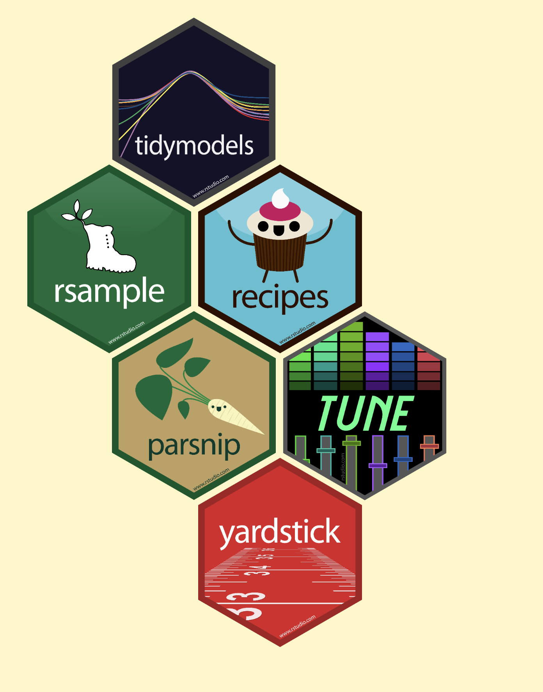{.absolute right=0 top=0}

##

```r
#> # A tibble: 12 × 10
#>    package      cli_abort cli_warn cli_inform abort  warn inform  stop warning message
#>    <chr>            <int>    <int>      <int> <int> <int>  <int> <int>   <int>   <int>
#>  1 dials                0        0          0    68     6      1     1       0       0
#>  2 hardhat             18        0          0    52     4      0     0       0       0
#>  3 infer                0        0          0     0     0      0     1       1       1
#>  4 modeldata            0        0          0     3     0      0     0       0       0
#>  5 parsnip              3        3          0   230    46      0    13       0       9
#>  6 recipes              3        0          0   185    40      0    16       0       2
#>  7 rsample              5        0          0   133    14      0     0       0       0
#>  8 tune                13        1          2   146    23      2     0       5       9
#>  9 workflows            0        0          0    65    10      0     0       0       0
#> 10 workflowsets         0        0          0    17     8      0     0       1       7
#> 11 yardstick            0        0          0   111    12      0     4       0       2
#> 12 tidymodels           0        0          0     2     0      0     0       0       3
```

::: footer
<https://gist.github.com/EmilHvitfeldt/0731497636221aa2d5db22e0dccd0774>
:::

## {background-image="images/wojciech-then-vOcN86ENwkU-unsplash.jpg"}

::: fragment
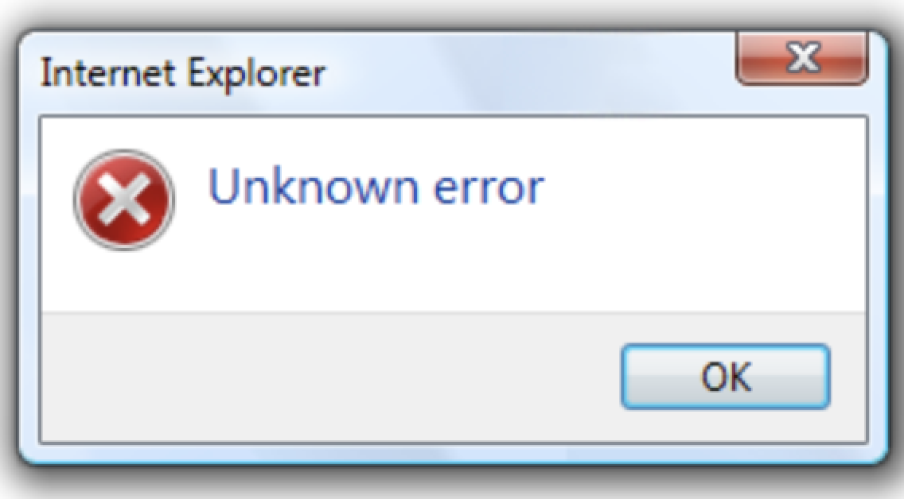{.absolute left=0 top=0 width=500px}
:::

::: fragment
{.absolute left=0 top=0 width=500px}
:::

::: fragment
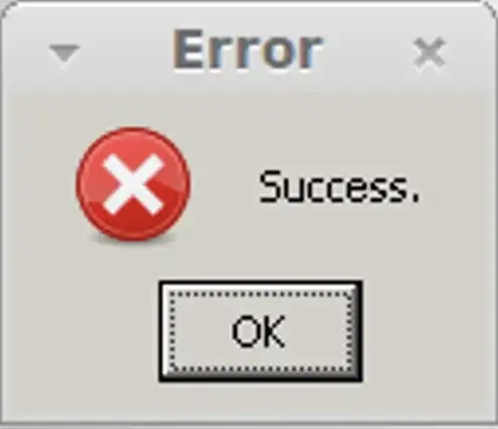{.absolute left=0 top=0 width=500px}
:::

::: fragment
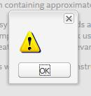{.absolute left=0 top=0 width=500px}
:::

::: {.footer .footer-bg}
Photo by <a href="https://unsplash.com/@wthen?utm_content=creditCopyText&utm_medium=referral&utm_source=unsplash">Wojciech Then</a> on <a href="https://unsplash.com/photos/green-covered-mountains-vOcN86ENwkU?utm_content=creditCopyText&utm_medium=referral&utm_source=unsplash">Unsplash</a>
:::

## {background-image="images/stefan-wagener-QM8nxL1X8mE-unsplash.jpg"}

::: {.footer .footer-bg}
Photo by <a href="https://unsplash.com/@stefanwagener?utm_content=creditCopyText&utm_medium=referral&utm_source=unsplash">Stefan Wagener</a> on <a href="https://unsplash.com/photos/empty-mountain-bridge-QM8nxL1X8mE?utm_content=creditCopyText&utm_medium=referral&utm_source=unsplash">Unsplash</a>
:::

## {cli} package 

> Helpers for Developing Command Line Interfaces

A suite of tools to build attractive command line interfaces (CLIs), from semantic elements: headers, lists, alerts, paragraphs, etc. Supports theming via a CSS-like language. It also contains a number of lower level CLI elements: rules, boxes, trees, and Unicode symbols with ASCII alternatives. It supports ANSI markup for terminal colors and font styles.

::: footer
<https://cli.r-lib.org/index.html>
:::

## why {cli}?

It can do a lot, not just error messages

- all kinds of text interface

It follows `rlang::abort()` with `cli::cli_abort()`

## Passing calls around - before


::: {.cell}

```{.r .cell-code}
internal_checker <- function(x) {
  if (any(x < 0)) {
    cli::cli_abort("x must be positive.")
  }
}

user_facing_function <- function(x) {
  internal_checker(x)
  sqrt(x)
}

user_facing_function(-5)
```


::: {.cell-output-display}
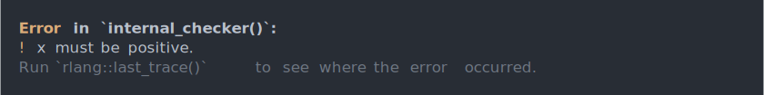{width=960}
:::
:::


## Passing calls around - after


::: {.cell}

```{.r .cell-code}
internal_checker <- function(x, call = rlang::caller_env()) {
  if (any(x < 0)) {
    cli::cli_abort("x must be positive.", call = call)
  }
}

user_facing_function <- function(x) {
  internal_checker(x)
  sqrt(x)
}

user_facing_function(-5)
```


::: {.cell-output-display}
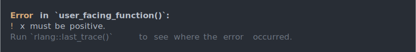{width=960}
:::
:::


## {glue} Interpolation


::: {.cell}

```{.r .cell-code}
internal_checker <- function(x, call = rlang::caller_env()) {
  if (any(x < 0)) {
    cli::cli_abort("x must be positive, not {x}.", call = call)
  }
}

user_facing_function <- function(x) {
  internal_checker(x)
  sqrt(x)
}

user_facing_function(-5)
```


::: {.cell-output-display}
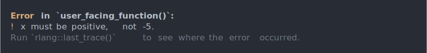{width=960}
:::
:::


## inline text formatting


::: {.cell}

```{.r .cell-code}
internal_checker <- function(x, call = rlang::caller_env()) {
  if (any(x < 0)) {
    cli::cli_abort(
      "{.arg x} must be positive, not {.val {x}}.", call = call
    )
  }
}

user_facing_function <- function(x) {
  internal_checker(x)
  sqrt(x)
}
user_facing_function(-5)
```


::: {.cell-output-display}
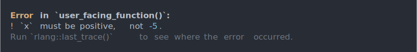{width=960}
:::
:::


## How to write a function that can error 

```r
user_facing_function <- function(x) {
  if (!is.numeric(x)) {
    cli::cli_abort(
      "{.arg x} must be numeric"
    )
  }

  if (any(x < 0)) {
    cli::cli_abort(
      "{.arg x} must be positive, not {.val {x}}."
    )
  }
  sqrt(x)
}

user_facing_function(-5)
```

## Priorities when writing user-facing functions

the checks should happen as early as possible

the checks should be as fast as possible

constructing the error doesn't have to be that fast

## Example 1 - before


::: {.cell}

```{.r .cell-code}
library(yardstick)

roc_curve(two_class_example, truth = truth, estimate = Class1)
```
:::

::: {.cell}
::: {.cell-output-display}
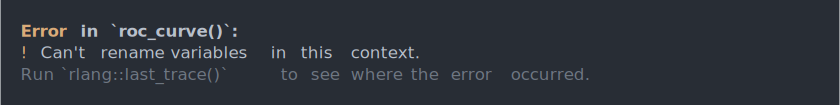{width=960}
:::
:::


::: footer
<https://github.com/tidymodels/yardstick/pull/485>
:::

## Example 1 - after


::: {.cell}

```{.r .cell-code}
library(yardstick)

roc_curve(two_class_example, truth = truth, estimate = Class1)
```


::: {.cell-output-display}
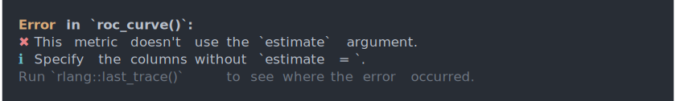{width=960}
:::
:::


::: footer
<https://github.com/tidymodels/yardstick/pull/485>
:::

## Example 1 - solution

```r
if ("estimate" %in% names(match.call(expand.dots = FALSE)$...)) {
  cli::cli_abort(
    c(
      x = "This metric doesn't use the {.arg estimate} argument.",
      i = "Specify the columns without {.code estimate = }."
    ),
    call = error_call
  )
}
```

::: footer
<https://github.com/tidymodels/yardstick/pull/485>
:::

## Example 2 - before


::: {.cell}

```{.r .cell-code}
library(recipes)

dat <- data.frame(x = as.character(1:100000))

recipe(~ ., data = dat) %>%
  step_dummy(x) %>%
  prep()
```
:::

::: {.cell}
::: {.cell-output-display}
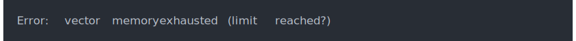{width=960}
:::
:::


::: footer
<https://github.com/tidymodels/recipes/pull/1327>
:::

## Example 2 - after


::: {.cell}

```{.r .cell-code}
library(recipes)

dat <- data.frame(x = as.character(1:100000))

recipe(~ ., data = dat) %>%
  step_dummy(x) %>%
  prep()
```


::: {.cell-output-display}
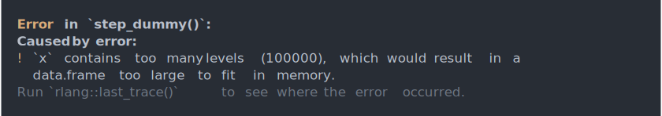{width=960}
:::
:::


::: footer
<https://github.com/tidymodels/recipes/pull/1327>
:::

## Example 2 - solution

```r
indicators <- tryCatch(
  model.matrix(object = levels, data = indicators),
  error = function(cnd) {
    if (grepl("(vector memory|cannot allocate)", cnd$message)) {
      
      n_levels <- length(attr(levels, "values"))
      
      cli::cli_abort(
        "{.var {col_name}} contains too many levels ({n_levels}), \\
        which would result in a data.frame too large to fit in memory.",
        call = NULL
      )
    }
    stop(cnd)
  }
)
```

::: footer
<https://github.com/tidymodels/recipes/pull/1327>
:::

## Example 3 - before


::: {.cell}

```{.r .cell-code}
library(recipes)
library(hardhat)

recipe(~., data = mtcars) |>
  step_pca(all_predictors(), threshold = tune()) |>
  step_kpca(all_predictors(), num_comp = tune()) |>
  step_bs(all_predictors(), deg_free = tune()) |>
  prep()
```
:::

::: {.cell}
::: {.cell-output-display}
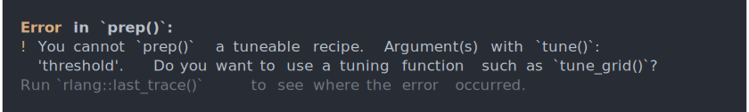{width=960}
:::
:::


::: footer
<https://github.com/tidymodels/recipes/pull/1251>
:::

## Example 3 - after


::: {.cell}

```{.r .cell-code}
library(recipes)
library(hardhat)

recipe(~., data = mtcars) |>
  step_pca(all_predictors(), threshold = tune()) |>
  step_kpca(all_predictors(), num_comp = tune()) |>
  step_bs(all_predictors(), deg_free = tune()) |>
  prep()
```


::: {.cell-output-display}
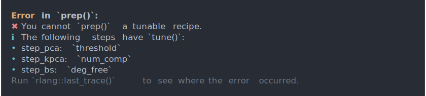{width=960}
:::
:::


::: footer
<https://github.com/tidymodels/recipes/pull/1251>
:::

## Example 3 - solution

```r
if (nrow(needs_tuning) > 0) {
  args <- vctrs::vec_split(needs_tuning$arg, needs_tuning$step)
  msg <- c(
    x = "You cannot {.fun prep} a tunable recipe.",
    i = "{cli::qty(nrow(args))}The following step{?s} \\
         {?no/has/have} {.fun tune}:"
  )

  step_msg <- paste0(
    "{needs_tuning$step[",
    seq_len(nrow(needs_tuning)),
    "]}: {.and {.arg {needs_tuning$arg[",
    seq_len(nrow(needs_tuning)),
    "]}}}"
  )
  names(step_msg) <- rep("*", nrow(needs_tuning))

  cli::cli_abort(c(msg, step_msg))
}
```

::: footer
<https://github.com/tidymodels/recipes/pull/1251>
:::

## Thank you! {.theme-title2 .center style="text-align:center;"}
